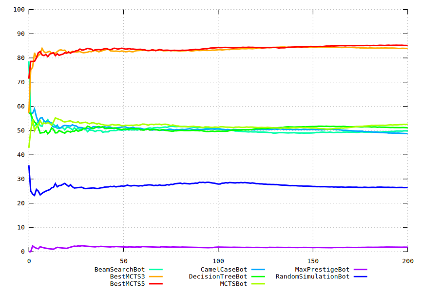

# Tales of Tribute AI Competition at IEEE Conference on Games 2023

Tales of Tribute AI Competition has been one of the events at [IEEE COG 2023](https://2023.ieee-cog.org/competitions/).


The Scripts of Tribute version was [1.01](https://github.com/ScriptsOfTribute/ScriptsOfTribute-GUI/releases/tag/v1.01) featuring 6 patron decks (Pelin, Hlaalu, Crows, Ansei, Rajhin, Red Eagle) and  compatible with Tales of Tribute from ESO PC/Mac Patch 8.3.5 (15.03.2023).


### Results

The results of the competition were officially presented during the conference: [youtube video](https://www.youtube.com/watch?v=czrAa6kFENk).

The winnng agent, developed by Adam Ciężkowski Artur Krzyżyński is described in their [engineer's thesis](https://jakubkowalski.tech/Supervising/Ciezkowski2023DevelopingCard.pdf).





### Reproducibility

Here is the code allowing to rerun the competition.

All participating agents are available in the repository.

```sh
# Stock Ubuntu 22.04
source setup.sh
source prepare.sh
source run.sh | tee out-1.txt &
source run.sh | tee out-2.txt &
source run.sh | tee out-3.txt &
source run.sh | tee out-4.txt &
wait
source graph.sh
```


## Archival Call for Participants


### Important Dates

- **7th August 2023**, 23:59 GMT - **Submission deadline (EXTENDED)**
- 21-24 August 2023 - [COG conference](https://2023.ieee-cog.org/) and results announcement


### Submission Rules

- Please send a single `.cs` file containing your agent's source code or a zip archive with all the others necessary files to jko@cs.uni.wroc.pl.
- Additionally, the email should contain:
  - Agent's name.
  - Names (and institutions, if any) of all agent's authors.
  - Short description of the agent. Preferably a few slides or a short note in markdown or PDF; it has to describe what does the agent do, e.g., whether it employs some search algorithms or neural networks.
- Multiple bots can be submitted, but please indicate if a submission should replace an old one or be counted as a new submission (with a different agent's name). Each participant can have up to 2 final submissions. 
- Please be aware that submitted agents are going to be published in this repository after the competition. With the submission, you agree with this procedure.


### Evaluation

Agents will be evaluated using the [SoT-Core Game Runner](https://github.com/ScriptsOfTribute/ScriptsOfTribute-Core), on a large number of mirror matches using randomly generated seeds in an all-play-all system. The deciding factor will be the average winrate.

Time limit:
- 10 seconds for every turn

Memory limit and other constraints:
- while playing, the bot should not exceed 256 MB of memory. Anytime exceedance of 1024 MB of RAM usage will result in excluding the bot from the contest
- the size of sent file/archive should not exceed 25 MB


Game version:
- compatible with Tales of Tribute from ESO PC/Mac Patch 8.3.5 (15.03.2023)
- 6 patrons available: [Pelin](https://en.uesp.net/wiki/Online:Saint_Pelin), [Hlaalu](https://en.uesp.net/wiki/Online:Grandmaster_Delmene_Hlaalu), [Crows](https://en.uesp.net/wiki/Online:Duke_of_Crows_(Patron)), [Ansei](https://en.uesp.net/wiki/Online:Ansei_Frandar_Hunding), [Rajhin](https://en.uesp.net/wiki/Online:Rajhin), and [Red Eagle](https://en.uesp.net/wiki/Online:Red_Eagle).
- all decks are assumed to be fully upgraded


### Prizes

$500 for the first place.
Prize founded by the [IEEE CIS Education Competition Subcommittee](https://cis.ieee.org/).


