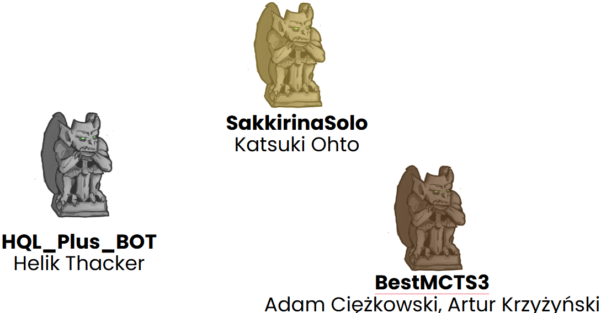
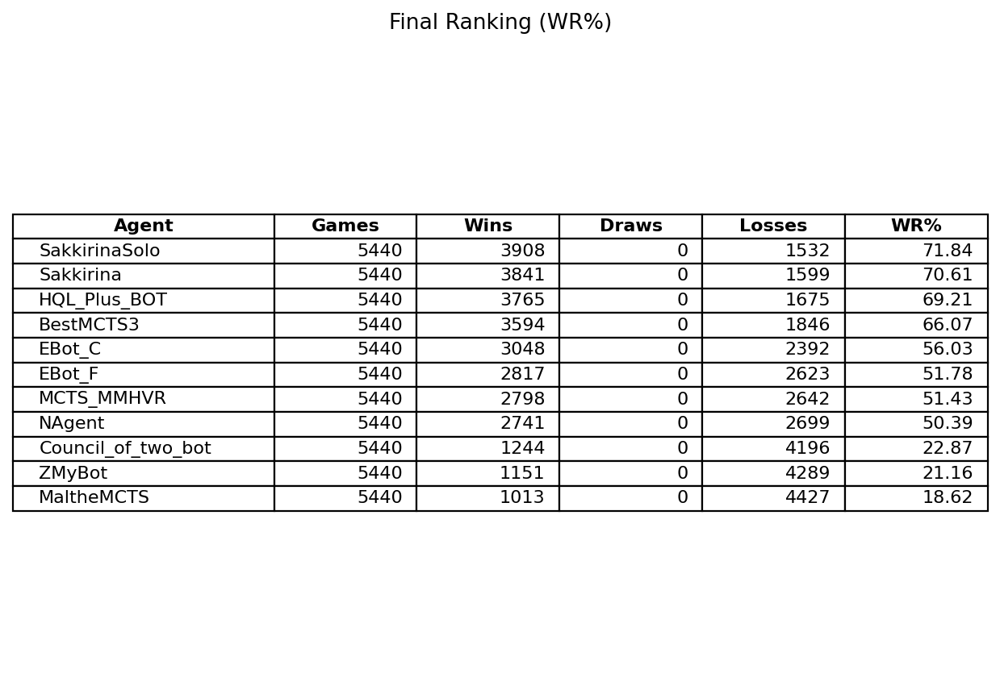
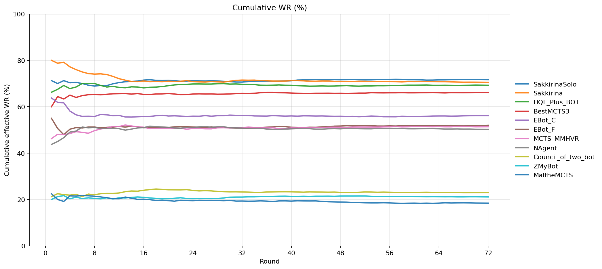
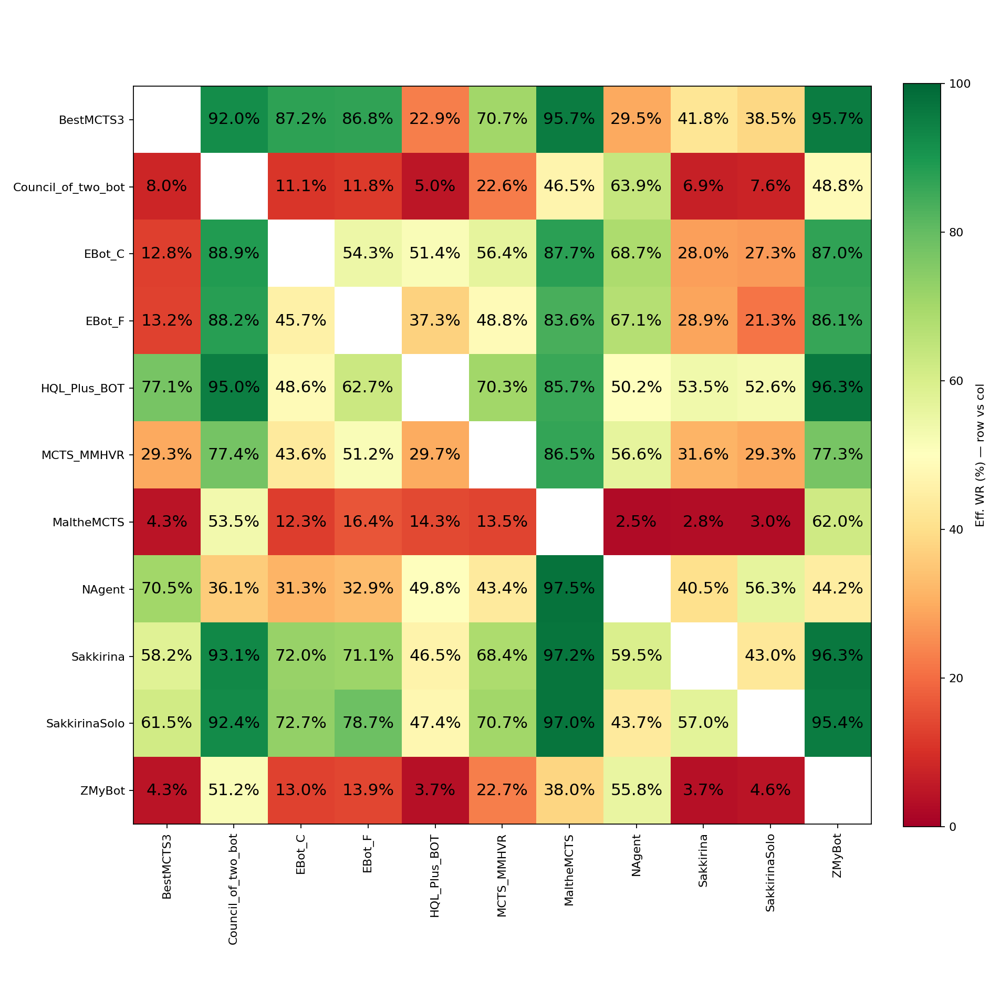

# Tales of Tribute AI Competition at IEEE Conference on Games 2025

Tales of Tribute AI Competition has been one of the events at [IEEE COG 2025](https://cog2025.inesc-id.pt/competitions/).

The Scripts of Tribute version was [1.1.1](https://github.com/ScriptsOfTribute/ScriptsOfTribute-GUI/releases/tag/v1.1.1) featuring 6 patron decks (Pelin, Crows, Ansei, Rajhin, Orgnum, and Alessia.) and  compatible with Tales of Tribute from ESO PC/Mac Patch 10.3.5 (10.03.2025).

Competition poster is available [here](./poster.pdf)

The results of the competition were [officially presented](./slides.pdf)  during the conference.

### Results












### Reproducibility

Here is the code allowing to rerun the competition.

All participating agents are available in the repository.

```sh
# Stock Ubuntu 24.04
source setup.sh
source prepare.sh
source run.sh | tee out-1.txt & # One per server.
source run.sh | tee out-2.txt & # One per server.
source run.sh | tee out-3.txt & # One per server.
source run.sh | tee out-4.txt & # One per server.
wait
source graph.sh
```


## Archival Call for Participants


#### Changes from 2024 edition

- gRPC communication
- Python ScriptsOfTribute library
- Added Saint Alessia deck
- Applied balance changes compatible with latest ESO patch
- Multiple QoL changes for writing and testing agents


### Important Dates

- **10th August 2025**, 23:59 GMT - **Submission deadline**
- 26th-29th August 2025 - [COG conference](https://cog2025.inesc-id.pt/) and results announcement


### Submission Rules

- Please send a single `.cs` file containing your agent's source code or a zip archive with all the others necessary files to jko@cs.uni.wroc.pl.
- In case of bots made in Python please provide files with source code + `requirements.txt` file archived in zip file.
- In case of agents written in other programming languages please attach compilation/run instructions.
- Additionally, the email should contain:
  - Agent's name.
  - Names (and institutions, if any) of all agent's authors.
  - Short description of the agent. Preferably a few slides or a short note in markdown or PDF; it has to describe what does the agent do, e.g., whether it employs some search algorithms or neural networks.
- Multiple bots can be submitted, but please indicate if a submission should replace an old one or be counted as a new submission (with a different agent's name). Each participant can have up to 2 final submissions. 
- Please be aware that submitted agents are going to be published in this repository after the competition. With the submission, you agree with this procedure.


### Evaluation

Agents will be evaluated using the [SoT-Core Game Runner](https://github.com/ScriptsOfTribute/ScriptsOfTribute-Core), on a large number of mirror matches using randomly generated seeds in an all-play-all system. The deciding factor will be the average winrate.

Evaluation environment will be compatible with the one provided by [Dockerfile](https://github.com/ScriptsOfTribute/ScriptsOfTribute-Core/blob/master/Dockerfile).

Time limit:
- 10 seconds for every turn

Memory limit and other constraints:
- while playing, the bot should not exceed 256 MB of memory. Anytime exceedance of 1024 MB of RAM usage will result in excluding the bot from the contest
- the size of sent file/archive should not exceed 25 MB


Game version:
- compatible with Tales of Tribute from ESO PC/Mac Patch 10.3.5 (10.03.2025) 
- 6 patrons available: [Pelin](https://eso-hub.com/en/tales-of-tribute/saint-pelin), [Crows](https://eso-hub.com/en/tales-of-tribute/duke-of-crows), [Ansei](https://eso-hub.com/en/tales-of-tribute/ansei-frandar-hunding), [Rajhin](https://eso-hub.com/en/tales-of-tribute/rajhin-the-purring-liar), [Orgnum](https://eso-hub.com/en/tales-of-tribute/sorcerer-king-orgnum), and [Alessia](https://eso-hub.com/en/tales-of-tribute/saint-alessia).
- all decks are assumed to be fully upgraded


### Prizes

<!--We will apply for prizes; more info soon.-->


- $500USD for the first place
- $300USD for the second place
- $200USD for the third place
 
Prizes founded by the [IEEE CIS Conference Competitions Subcommittee](https://cis.ieee.org/).


